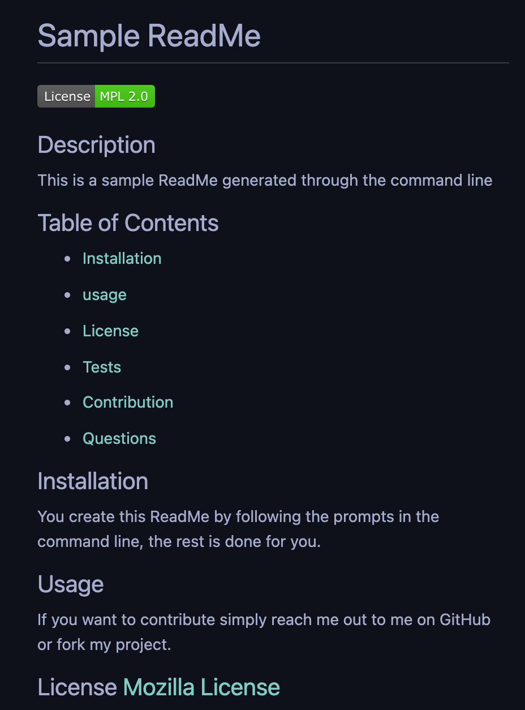
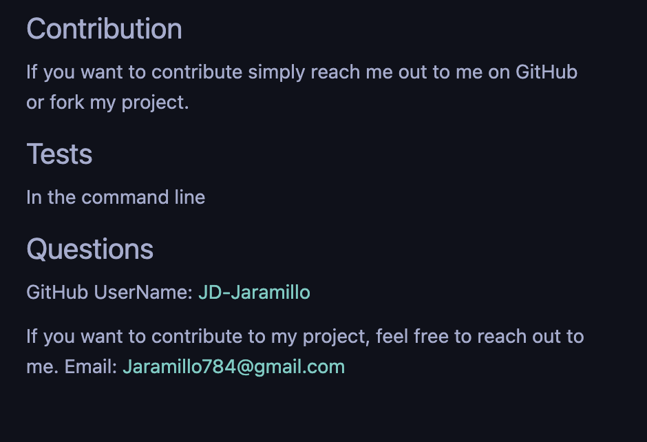

# ReadMe-Generator
Creates professional ReadMe files using the command line 

## Table of Contents

* [JS](#JS)
* [Requirements](#Requirements)
* [Installation](#Installation)
* [Contributing](#Contributing)

## JS
Created the prompts for the user to respond to and then create the ReadMe with, then created a function to initialize the app and grab the answers from the prompts to write the readme with. Another JS page created gets the licese information selected and also returns the Markdown with template literals. 

Link to deployed ReadMe Generator: [Deployed site](https://jd-jaramillo.github.io/ReadMe-Generator/)

## Requirements

GIVEN a command-line application that accepts user input
WHEN I am prompted for information about my application repository
THEN a high-quality, professional README.md is generated with the title of my project and sections entitled Description, Table of Contents, Installation, Usage, License, Contributing, Tests, and Questions
WHEN I enter my project title
THEN this is displayed as the title of the README
WHEN I enter a description, installation instructions, usage information, contribution guidelines, and test instructions
THEN this information is added to the sections of the README entitled Description, Installation, Usage, Contributing, and Tests
WHEN I choose a license for my application from a list of options
THEN a badge for that license is added near the top of the README and a notice is added to the section of the README entitled License that explains which license the application is covered under
WHEN I enter my GitHub username
THEN this is added to the section of the README entitled Questions, with a link to my GitHub profile
WHEN I enter my email address
THEN this is added to the section of the README entitled Questions, with instructions on how to reach me with additional questions
WHEN I click on the links in the Table of Contents
THEN I am taken to the corresponding section of the README

## Installation

There is no need to install anything, to view the ReadMe Generator simply follow the link below. 

See deployed site here: [Deployed site](https://jd-jaramillo.github.io/ReadMe-Generator/) 

See repository here: [GitHub Repo](https://github.com/JD-Jaramillo/ReadMe-Generator)

## Contributing

If you have any tips or ideas on how to improve the ReadMe Generator please reach out to me directly. 

Email: Jaramillo784@gmail.com

